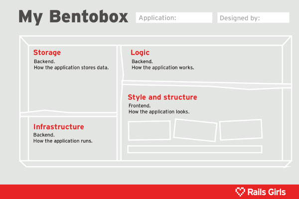

name: inverse
layout: true
class: center, middle, inverse
---
# Bentobox
Understanding web applications

.footnote[[Alek Małaszkiewicz](http://github.com/torrocus), CEO [Fractal Soft](http://fractalsoft.org)]

---

class: center, middle

# What is it?

---

class: center, middle

# Bentobox

---

layout: false

.left-column[
  ## Task
]
.right-column[
Put into the box:
- MySQL
- MongoDB
- HTML
- CSS
- Unicorn
- RoR
- Django
- CakePHP
- Ruby
- Python
- JavaScript
- PHP
- XML
- AJAX
- SaaS
- Apache

Hint: Use Google!
]

---

layout: false

.left-column[
  ## Task
  ## Solution
]
.right-column[
**Storage**: MySQL, MongoDB

**Infrastructure**: Unicorn, Apache

**Logic**: Django, CakePHP, Ruby, Python, PHP, RoR (Ruby on Rails)

**Style & structure**: HTML, CSS, XML, JavaScript, AJAX

**Outside**: SaaS (Software as a Service)

]

---

name: last-page
template: inverse

## Contact

twitter: @torrocus

facebook: torrocus

github: torrocus
